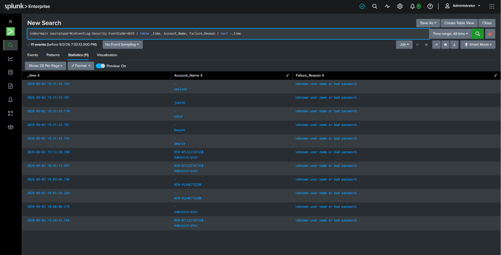
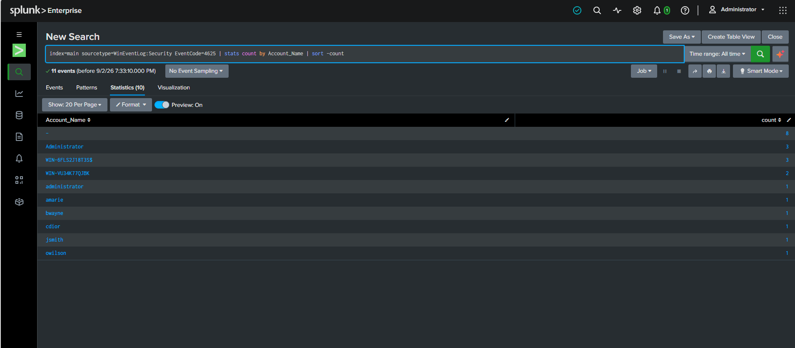
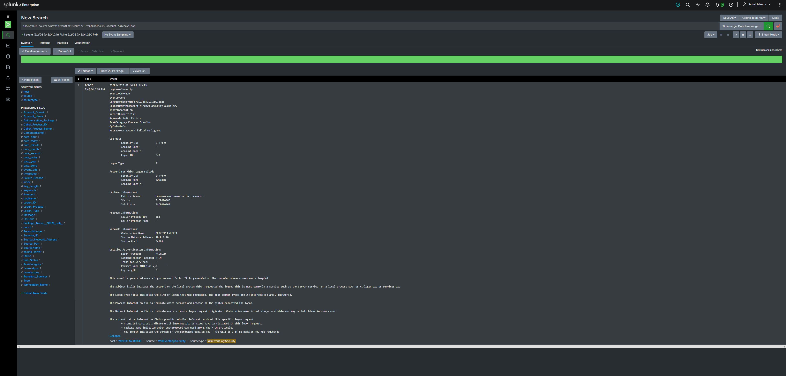

# AD Detection Lab - Password Spray Attack & Detection

A self-built home lab simulating a real-world Security Operations Center (SOC) workflow: standing up Active Directory, forwarding logs to a SIEM, launching an attack against the environment, and writing the detection logic to catch it.

## What I Built

- **Active Directory Domain Services (AD DS)** on a Windows Server 2025 VM (`DC01`), running the `lab.local` forest
- **DNS** integrated with the domain controller
- A **Windows 11 client VM** (`Client01`) joined to the domain
- **Splunk Enterprise** installed locally on the DC, ingesting Windows Security event logs via a local event log input
- Five test AD user accounts to serve as attack targets

All VMs were built in VirtualBox on a shared NAT Network so the DC and client could communicate on the same subnet.

## The Attack

I simulated a **password spray** - a technique where an attacker tries one common password against many different usernames, rather than many passwords against one account (which would trip a lockout policy faster).

Using PowerShell's `System.DirectoryServices.AccountManagement` namespace, I validated a single incorrect password against five domain accounts in quick succession:

```powershell
Add-Type -AssemblyName System.DirectoryServices.AccountManagement
$dc = New-Object System.DirectoryServices.AccountManagement.PrincipalContext('Domain','lab.local')
$users = @('amarie','bwayne','cdior','jsmith','owilson')
foreach ($u in $users) {
    $result = $dc.ValidateCredentials($u, 'Summer2024!')
    Write-Host "$u : $result"
}
```

**Note on method:** my first attempt used `Get-WmiObject -Credential`, which silently ran locally instead of authenticating against the domain because no `-ComputerName` was specified - it generated no failed-logon events at all. Switching to `ValidateCredentials` forced a genuine authentication attempt against AD, which is what actually produces Event ID 4625 in the Security log.

## The Detection

With Windows Security logs flowing into Splunk, I searched for failed logon events (**Event ID 4625**) and grouped them to spot the spray pattern.

**Query 1 - isolate failed logons and inspect the pattern:**
```
index=main sourcetype=WinEventLog:Security EventCode=4625 | table _time, Account_Name, Failure_Reason | sort -_time
```

This surfaced five distinct accounts - `owilson`, `jsmith`, `cdior`, `bwayne`, `amarie` - all failing within a **53-millisecond window**, clearly distinguishable from the scattered, single-account failures generated by normal background noise (mistyped logins, service accounts, etc.).



**Query 2 - aggregate to confirm the spread across accounts:**
```
index=main sourcetype=WinEventLog:Security EventCode=4625 | stats count by Account_Name | sort -count
```

This confirmed each of the five targeted accounts failed exactly once, in contrast to organic noise like repeated `Administrator` login failures spread across hours.



## Confirming the Attack Chain (Client → DC)

To make the attack scenario more realistic, I re-ran the spray from `Client01` (a domain-joined Windows workstation) instead of running it directly on the DC console - reflecting how a real attacker would more likely pivot from a compromised endpoint rather than have direct access to the Domain Controller itself.

Inspecting the raw Windows Security event confirmed the source:

```
Network Information:
    Workstation Name:      DESKTOP-LVHT0I1
    Source Network Address: 10.0.2.20
    Source Port:            64084
Logon Type: 3 (Network)
```

`10.0.2.20` is Client01's static IP, and the workstation name matches its local hostname - confirming the failed logon attempts genuinely originated from a separate domain-joined machine, not the DC itself.



## What This Demonstrates

- Practical understanding of **Active Directory** structure and administration
- Hands-on experience standing up and querying a **SIEM (Splunk)**
- The ability to simulate a real attack technique (**password spray**) end-to-end
- Writing **detection logic** that separates a genuine attack pattern from background noise using timestamp clustering - not just running a scan, but interpreting the result
- Troubleshooting a broken detection attempt (the WMI credential issue) and correcting the method - understanding *why* a technique works, not just copying a command

## Tools Used

| Tool | Purpose |
|---|---|
| VirtualBox | Virtualization platform for DC01 and Client01 |
| Windows Server 2025 (Evaluation) | Domain Controller OS |
| Windows 11 (Evaluation) | Domain-joined client |
| Splunk Enterprise (Free tier) | SIEM / log ingestion and search |
| PowerShell | Attack simulation (credential validation spray) |
